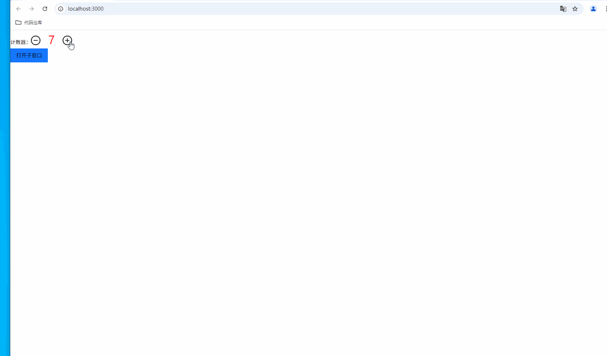
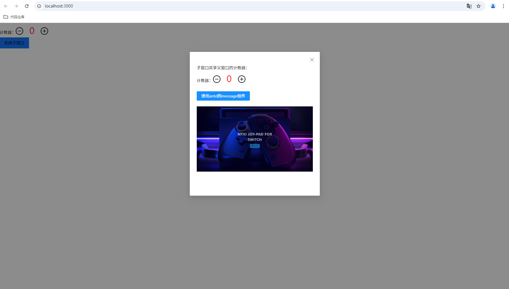
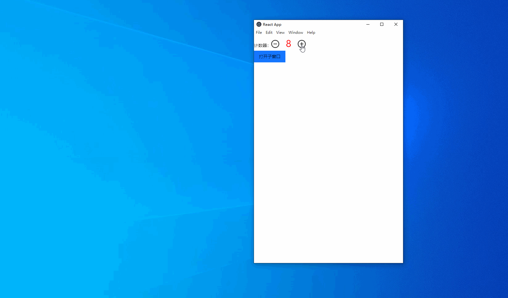
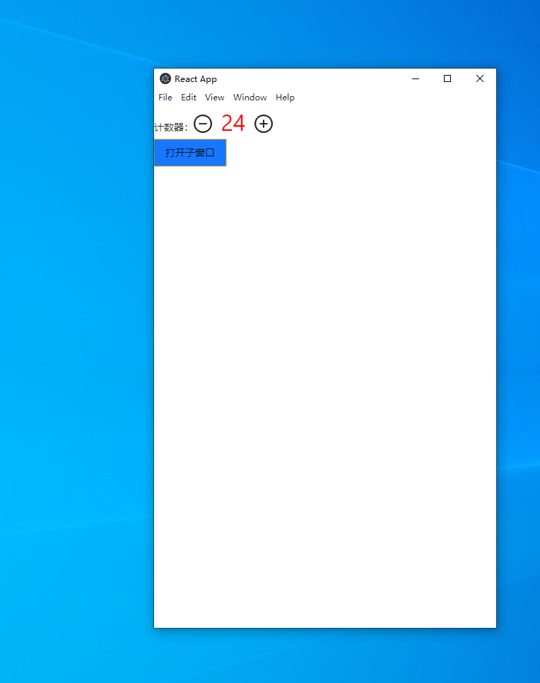
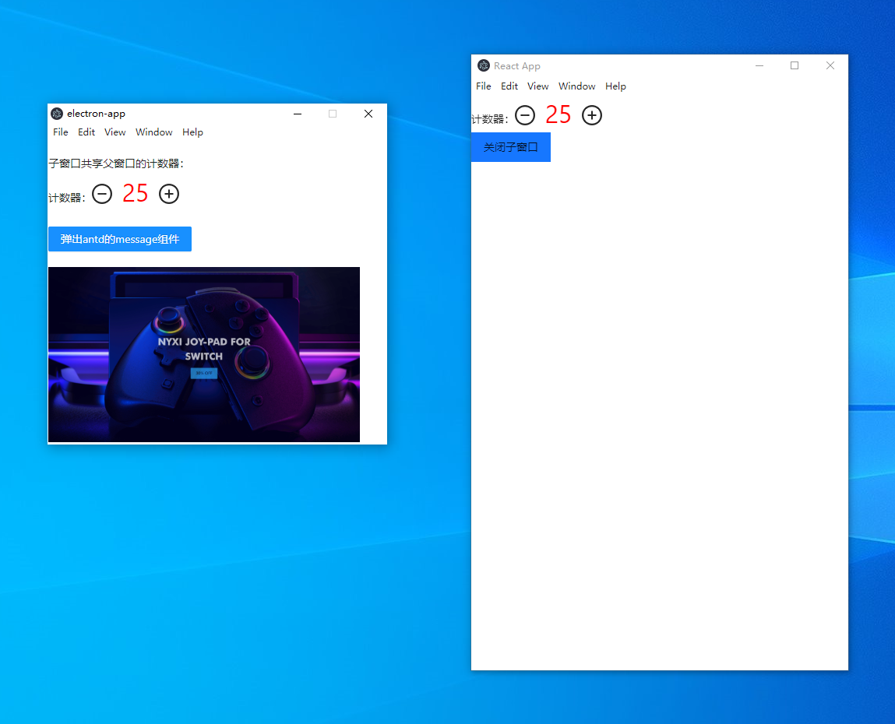

## 环境
- node：16 or > 16

## 运行
- npm install
- npm run start。（需要先启动web服务，见下面的依赖部分）


## 依赖
需要先启动web服务，web项目在[https://github.com/lizuncong/web-cross-platform-application](https://github.com/lizuncong/web-cross-platform-application)。web项目同样需要使用share-demo分支。web项目同样需要使用share-demo分支。web项目同样需要使用share-demo分支。web项目同样需要使用share-demo分支。web项目同样需要使用share-demo分支。web项目同样需要使用share-demo分支

## 是否可以用本地打包的方式？
可以的。

如果想体验web本地打包的资源丢到electron本地加载，可以先在[web端项目](https://github.com/lizuncong/web-cross-platform-application)运行npm run build，然后将打包出来的静态资源丢到src/window-open/build目录下面。

修改src/window-open/index.js，改成从本地加载的方式：
```js

// mainWindow.loadURL("http://localhost:3000/");

mainWindow.loadFile(path.join(__dirname, "build/index.html"));
```

src/window-open/build目录下已经有一个提前打包好的前端资源，可以直接使用。

>注意，web需要将BrowserRouter改成HashRouter

## 效果
在web端的效果如下，当在web端点击打开子窗口时，是以Modal的方式打开：








而在Electron客户端点击打开子窗口时，是以独立窗口的方式打开：








