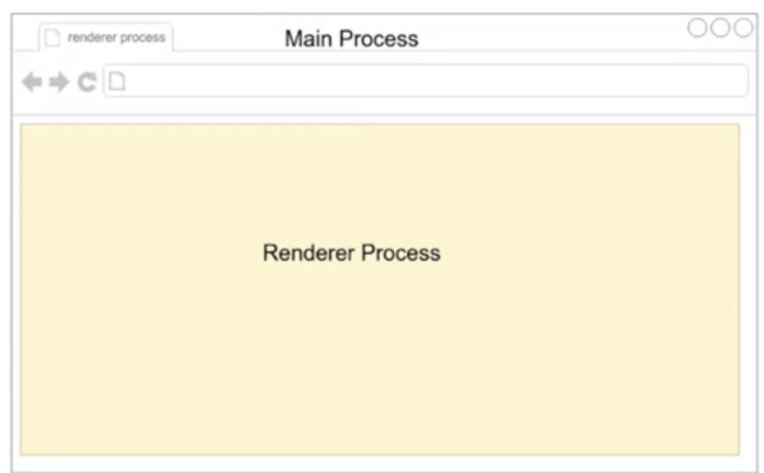
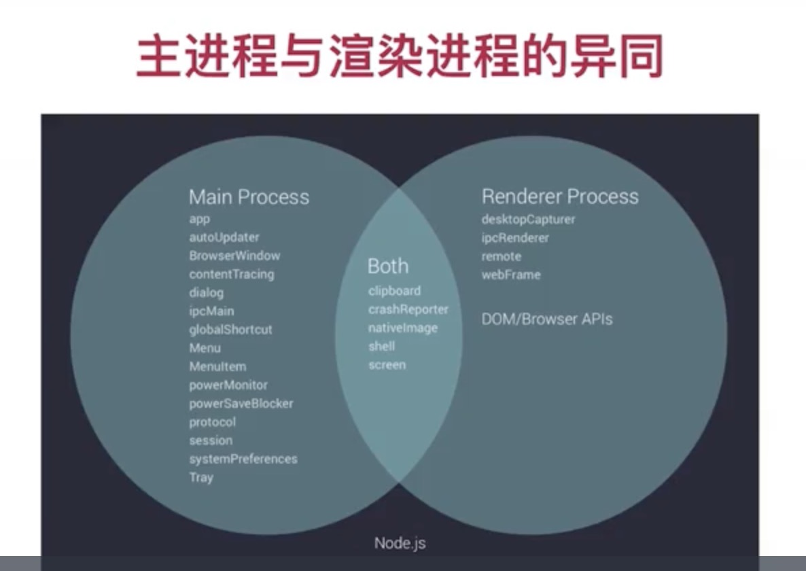

## 应用的架构

- Electron 主进程。负责创建窗口，提供原生应用的各种模块
- Electron 渲染进程。提供浏览器环境
  - React 作为 View 层完成各种交互
- Node.js。负责本地文件的创建管理、网络文件的下载等
- 七牛云对象存储。负责本地文件同步到云端提供上传下载的服务

## 收获

- Electron 的基础知识，各个内置模块的熟练应用
- 深入了解浏览器工作原理
- 理解进程概念和跨进程通信原理

## 进程和线程

- 线程是操作系统能够进行运算调度的最小单位。它被包含在进程之中，是进程中的实际运作单位

- 进程和线程之间的区别
  - 内存使用方面的区别。进程之间无法共享内存，线程之间可以共享内存
  - 通信机制方面的区别。进程之间可以通过 IPC 通信，线程之间通信就比较简单
  - 量级方面的区别。

## Electron：主进程和渲染进程

- 主进程（Main Process）的特点

  - 可以使用和系统对接的 Electron API：创建菜单，上传文件等等
  - 创建渲染进程：Renderer Process
  - 全面支持 Node.js
  - 只有一个，作为整个程序的入口点

- 渲染进程（Renderer Process）的特点
  - 可以有多个，每个对应一个窗口
  - 每个都是一个单独的进程
  - 全面支持 Node.js 和 DOM API
  - 可以使用一部分 Electron 提供的 API

